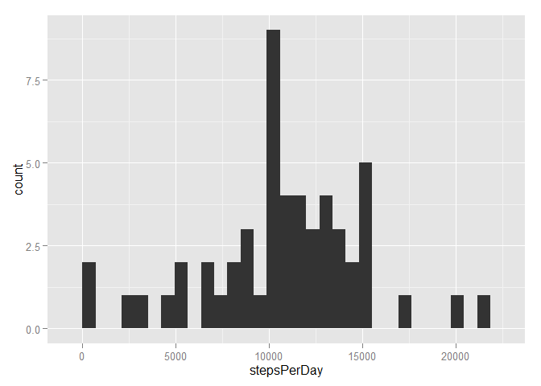
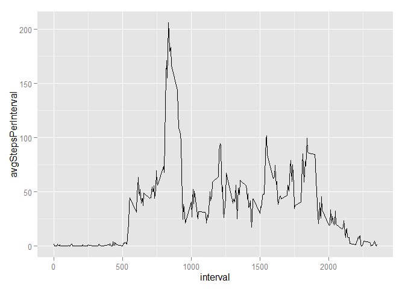
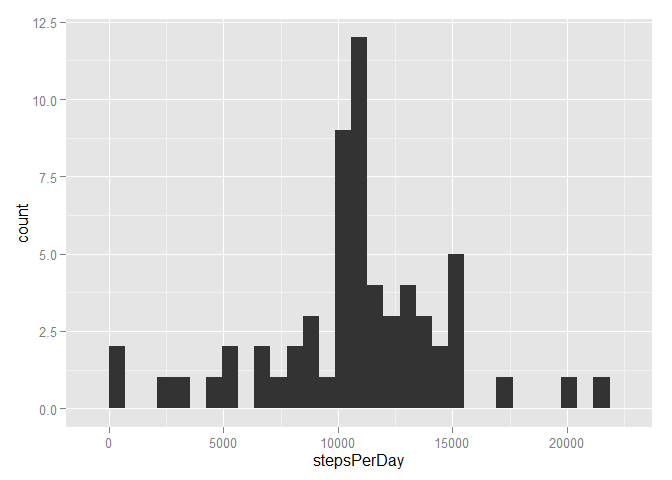
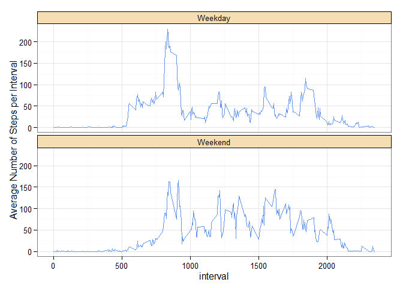

# Reproducible Research: Peer Assessment 1


## Loading and preprocessing the data

<<<<<<< HEAD
Set argument names

```r
fileDownloaded <- "activity.zip"
data_file <- "activity.csv"
```

Load the required libraries.

```r
library(downloader)
library(dplyr)
library(ggplot2)
library(scales)
library(RColorBrewer)
```


**1. Load the data**

Download the data file if it does not exist and save the date downloaded.

```r
if (! file.exists(data_file)) {
    # Download data and unzip.
    unzip(fileDownloaded)
}
```
    
Load the data into memory if it has not been previously loaded.

```r
if (! exists("ad")) {
    # Read data file.
    ad <- read.csv(data_file)
}
```


**2. Process/transform the data into a format suitable for analysis.**

How many rows have NAs?

```r
naCnt <- nrow(ad[!complete.cases(ad),])
sprintf("NAs in full dataset: %d, %2.2f%%", naCnt, (naCnt * 100)/nrow(ad))
```

```
## [1] "NAs in full dataset: 2304, 13.11%"
```

Create a data frame table.

```r
ad <- tbl_df(ad)
```

Change the date column from a factor into a POSIXct date.

```r
ad$date <- as.POSIXct(ad$date)
```
=======
>>>>>>> 80edf39c3bb508fee88e3394542f967dd3fd3270


## What is mean total number of steps taken per day?

<<<<<<< HEAD
**1. Calculate the total number of steps taken per day**

```r
adTotal1 <- ad %>%
    group_by(date) %>% 
    select(steps, date, interval) %>%
    summarise(stepsPerDay=sum(steps, na.rm=FALSE))
```


**2. Make a histogram of the total number of steps taken each day**

```r
ggplot(adTotal1, aes(x=stepsPerDay)) + geom_histogram()
```

 


**3. Calculate and report the mean and median of the total number of steps taken per day.**

```r
mean1 <- mean(adTotal1$stepsPerDay, na.rm=TRUE)
mean1
```

```
## [1] 10766.19
```

```r
median1 <- median(adTotal1$stepsPerDay, na.rm=TRUE)
median1
```

```
## [1] 10765
```
=======
>>>>>>> 80edf39c3bb508fee88e3394542f967dd3fd3270


## What is the average daily activity pattern?

<<<<<<< HEAD
**1. Make a time series plot (i.e. type = "l") of the 5-minute interval (x-axis) and the average number of steps taken, averaged across all days (y-axis).**

First calculate the average total steps taken per interval.

```r
adIntervalTotal1 <- ad %>%
    group_by(interval) %>% 
    select(steps, date, interval) %>%
    summarise(avgStepsPerInterval=mean(steps, na.rm=TRUE))
head(adIntervalTotal1)
```

```
## Source: local data frame [6 x 2]
## 
##   interval avgStepsPerInterval
## 1        0           1.7169811
## 2        5           0.3396226
## 3       10           0.1320755
## 4       15           0.1509434
## 5       20           0.0754717
## 6       25           2.0943396
```

Plot the average steps taken per interval.

```r
ggplot(adIntervalTotal1, aes(x=interval, y=avgStepsPerInterval)) + geom_line()
```

 

**2. Which 5-minute interval, on average across all the days in the dataset, contains the maximum number of steps?**


```r
interval <- adIntervalTotal1[which.max(adIntervalTotal1$avgStepsPerInterval), 1]
interval
```

```
## Source: local data frame [1 x 1]
## 
##   interval
## 1      835
```

```r
maxValue <- max(adIntervalTotal1$avgStepsPerInterval)
maxValue
```

```
## [1] 206.1698
```

## Imputing missing values

**1. Calculate and report the total number of missing values in the dataset (i.e. the total number of rows with NAs).**

How many rows have NAs?

```r
sum(!complete.cases(ad))
```

```
## [1] 2304
```

Which columns are missing values?

```r
sum(is.na(ad$date))
```

```
## [1] 0
```

```r
sum(is.na(ad$interval))
```

```
## [1] 0
```

```r
sum(is.na(ad$steps))
```

```
## [1] 2304
```

Only the steps column is missing values.


**2. Devise a strategy for filling in all of the missing values in the dataset,**

I chose the average steps per interval as the value for filling in the missing values. 

Calculate the average steps per interval.

```r
adIntervalMean1 <- ad %>%
    group_by(interval) %>% 
    select(steps, date, interval) %>%
    summarise(avgStepsPerInterval=round(mean(steps, na.rm=TRUE), digits=0))
```

Here's how we can select the intervals for the rows missing data.

```r
ad2 <- ad
head(ad2[is.na(ad2$steps),]$interval)
```

```
## [1]  0  5 10 15 20 25
```

Then match the intervals with the means calculated above.

```r
head(match(ad2[is.na(ad$steps),]$interval, adIntervalMean1$interval))
```

```
## [1] 1 2 3 4 5 6
```

Then select the average steps per interval for the interval missing a value.

```r
head(adIntervalMean1[match(ad2[is.na(ad2$steps),]$interval, adIntervalMean1$interval), 2]$avgStepsPerInterval)
```

```
## [1] 2 0 0 0 0 2
```

**3. Create a new dataset that is equal to the original dataset but with the missing data filled in.**

These are the row numbers.

```r
head(which(is.na(ad2$steps)))
```

```
## [1] 1 2 3 4 5 6
```

This combines the logic above to fill in the missing values.

```r
ad2[which(is.na(ad2$steps)),]$steps <- adIntervalMean1[match(ad2[is.na(ad2$steps),]$interval, adIntervalMean1$interval), 2]$avgStepsPerInterval
```

Now there are no NAs

```r
sum(is.na(ad2$steps))
```

```
## [1] 0
```


**4. Make a histogram of the total number of steps taken each day and Calculate and report the mean and median total number of steps taken per day. Do these values differ from the estimates from the first part of the assignment? What is the impact of imputing missing data on the estimates of the total daily number of steps?**

Calculate the total steps per day.

```r
adTotal2 <- ad2 %>%
    group_by(date) %>% 
    select(steps, date, interval) %>%
    summarise(stepsPerDay=sum(steps, na.rm=TRUE))
```

Make a histogram of the total number of steps taken each day.

```r
ggplot(adTotal2, aes(x=stepsPerDay)) + geom_histogram()
```

 

Calculate and report the mean and median of the total number of steps taken per day.

```r
mean2 <- mean(adTotal2$stepsPerDay)
mean2
```

```
## [1] 10765.64
```

```r
mean2 - mean1
```

```
## [1] -0.549335
```

```r
median2 <- median(adTotal2$stepsPerDay)
median2
```

```
## [1] 10762
```

```r
median2 - median1
```

```
## [1] -3
```

Both the mean and median are slightly lower, but close to their previous values as is expected with chosen strategy for imputing missing data.


## Are there differences in activity patterns between weekdays and weekends?

**1. Create a new factor variable in the dataset with two levels ?? ??weekday?? and ??weekend?? indicating whether a given date is a weekday or weekend day.**

A function to calculate the new factor.

```r
weekday <- function(date) {
    ifelse(weekdays(date) %in% c("Saturday", "Sunday"), "Weekend", "Weekday")
}
```

Add new factor column to data frame.

```r
ad2$dayType <-as.factor(weekday(ad2$date))
```

**2. Make a panel plot containing a time series plot (i.e. type = "l") of the 5-minute interval (x-axis) and the average number of steps taken, averaged across all weekday days or weekend days (y-axis).**

Calculate the average steps per interval by the new factor variable.

```r
adIntervalMean2 <- ad2 %>%
    group_by(interval, dayType) %>% 
    select(steps, date, interval, dayType) %>%
    summarise(avgStepsPerInterval=mean(steps, na.rm=TRUE))
```

Plot the results.

```r
ggplot(adIntervalMean2, aes(x=interval, y=avgStepsPerInterval)) +
    geom_line(color="cornflowerblue") +
    ylab("Average Number of Steps per Interval") +
    facet_wrap(~dayType, ncol=1) +
    theme_bw() +
    theme(strip.background = element_rect(fill="wheat", color="black"))
```

 


